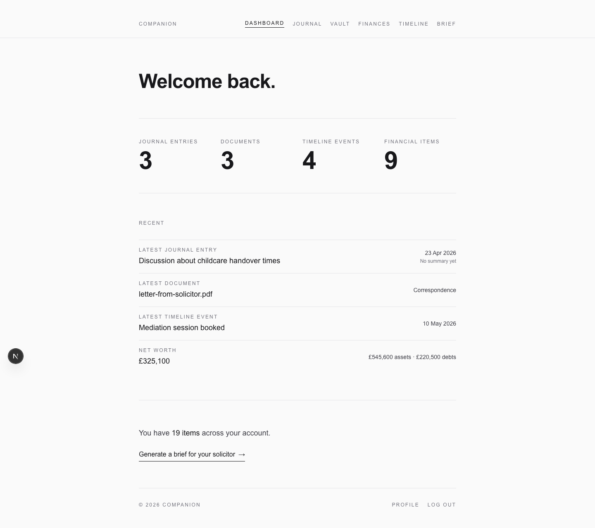
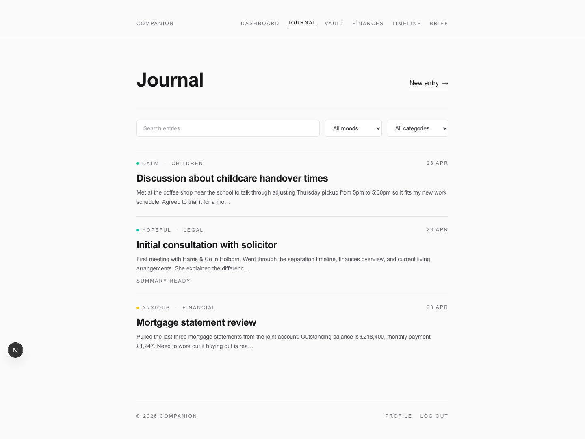
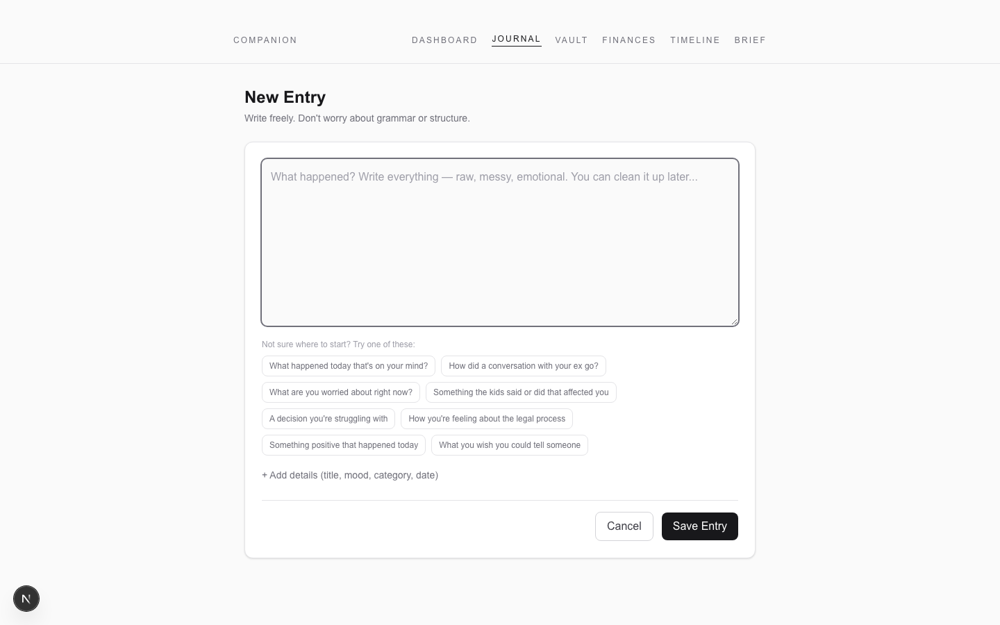
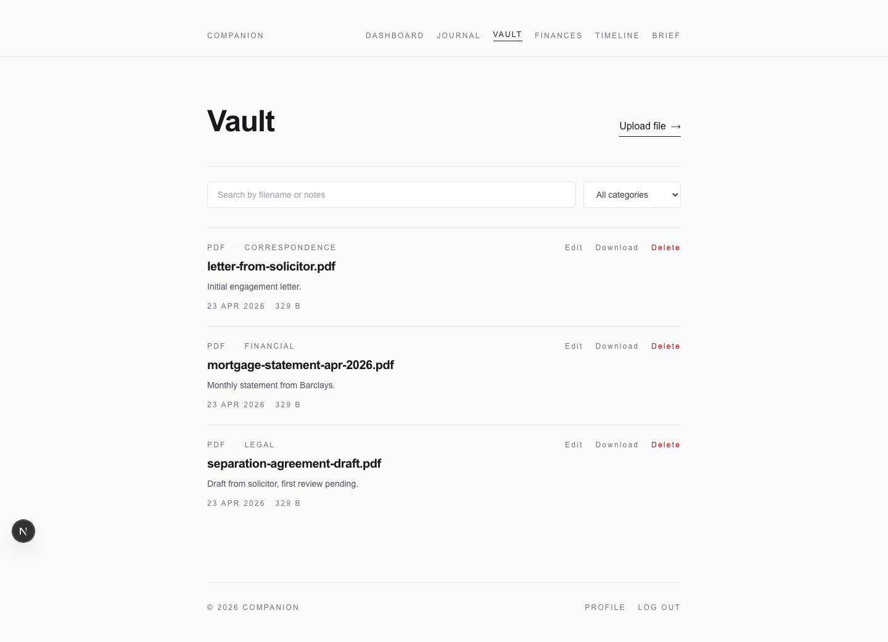
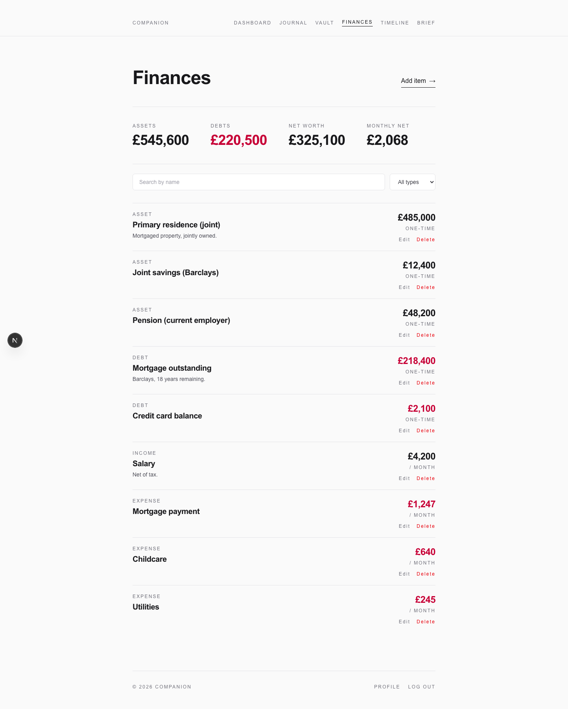
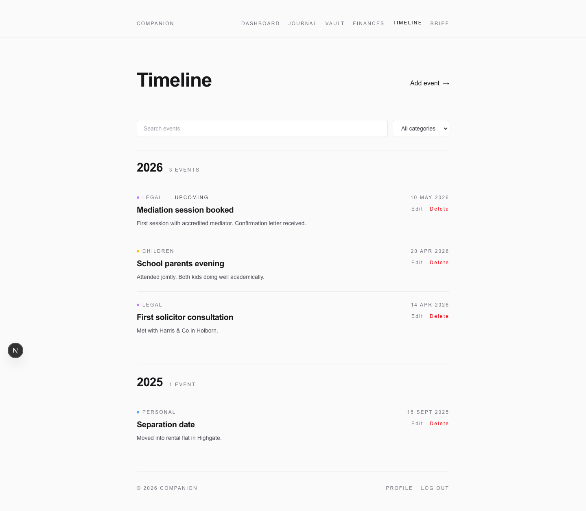
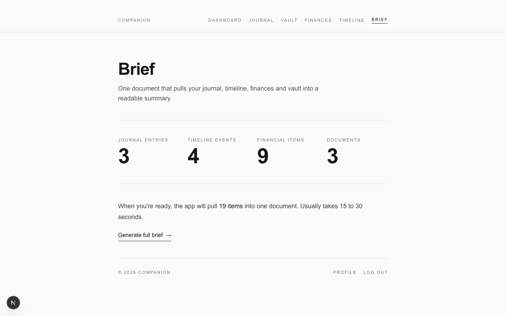

# Companion

App for people going through divorce. Private journal with AI summaries, document vault, financial tracker, timeline, and a brief generator that pulls everything together into something you can send to a solicitor.

No live link. The app is behind auth and the content is sensitive (finances, kids, legal stuff), so there are screenshots below instead.



## Journal

Entries get a mood and a category. You can search and filter them. Each entry has an optional AI summary that turns a messy dump of thoughts into a structured incident report with dates, people, and what happened. Easier to hand to a solicitor than raw journal prose.



The entry editor auto-saves to localStorage so a half-written entry doesn't vanish if you close the tab.



## Vault

Upload PDFs, images, and Word docs. Files live in Supabase Storage. Downloads use signed URLs with 60-second expiry so there are no permanent public links. 50 MB cap.



## Finances

Assets, debts, income, expenses. The monthly net number is frequency-aware so one-time, monthly, and annual items all get normalised correctly. Currency comes from the country picked during onboarding.



## Timeline

Events grouped by year. Future events show an upcoming badge. Useful for putting together a chronology of court dates, moves, handovers, and anything else that needs to be on record.



## Brief

Pulls the journal, finances, timeline, and document metadata together and runs it through an LLM. The output is something you can copy into an email or print to PDF.



## AI

Two endpoints, both use Groq with Llama 3.3 70B.

`POST /api/journal/summarise` takes one entry, checks ownership, and generates a structured report. Max 1024 tokens.

`POST /api/brief/generate` aggregates every table, caps journal entries at 30, prefers existing AI summaries over raw content, and returns the full brief. Max 3000 tokens.

The Groq client is lazily initialised so a missing env var doesn't crash the Vercel build.

## Running locally

```
npm install
```

Add a `.env.local`:

```
NEXT_PUBLIC_SUPABASE_URL=your_supabase_project_url
NEXT_PUBLIC_SUPABASE_ANON_KEY=your_supabase_anon_key
GROQ_API_KEY=your_groq_api_key
```

```
npm run dev
```

You need a Supabase project with tables for profiles, journal entries, documents, financial items, timeline events, and checklist progress. Everything is behind RLS (`user_id = auth.uid()`) and the `documents` bucket needs the same.

## Stack

- Next.js 16 (App Router) with React 19 and the React Compiler
- TypeScript, strict mode
- Tailwind v4, dark mode throughout
- Supabase for auth, Postgres, and storage, via `@supabase/ssr`
- Groq SDK for the AI
- Deployed on Vercel
